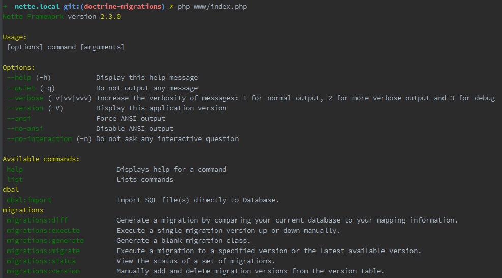

# Doctrine Migrations

[](https://travis-ci.org/Symplify/DoctrineMigrations)
[](https://scrutinizer-ci.com/g/Symplify/DoctrineMigrations)
[](https://packagist.org/packages/symplify/doctrine-migrations)

Implementation of [Doctrine\Migrations](http://docs.doctrine-project.org/projects/doctrine-migrations/en/latest/) to Nette.


## Install

```sh
composer require symplify/doctrine-migrations
```

Register extensions in `config.neon`:

```yaml
extensions:
	- Arachne\ContainerAdapter\DI\ContainerAdapterExtension
	- Arachne\EventDispatcher\DI\EventDispatcherExtension
	migrations: Symplify\DoctrineMigrations\DI\MigrationsExtension

	# Kdyby\Doctrine or another Doctrine integration
	doctrine: Kdyby\Doctrine\DI\OrmExtension
```


## Configuration

`config.neon` with default values

```yaml
migrations:
	table: doctrine_migrations # database table for applied migrations
	column: version # database column for applied migrations
	directory: %appDir%/../migrations # directory, where all migrations are stored
	namespace: Migrations # namespace of migration classes
	codingStandard: tabs # or "spaces", coding style for generated classes
	versionsOrganization: null # null, "year" or "year_and_month", organizes migrations to subdirectories
```


## Usage

Open your CLI and run command (based on `Kdyby\Console` integration):

```sh
php www/index.php
```

And then you should see all available commands:




### Migrate changes to database

If you want to migrate existing migration to your database, just run migrate commmand:
 
```sh
php www/index.php migrations:migrate
```

If you get lost, just use `-h` option for help:

```sh
php www/index.php migrations:migrate -h
```

### Create new migration

To create new empty migration, just run:

```sh
php www/index.php migrations:generate
```

A new empty migration will be created at your migrations directory. You can add your sql there then.

Migration that would add new role `"superadmin"` to `user_role` table would look like this:

```php
namespace Migrations;

use Doctrine\DBAL\Migrations\AbstractMigration;
use Doctrine\DBAL\Schema\Schema;

/**
 * New role "superadmin" added.
 */
final class Version20151015000003 extends AbstractMigration
{

	public function up(Schema $schema)
	{
		$this->addSql("INSERT INTO 'user_role' (id, value, name) VALUES (3, 'superadmin', 'Super Admin')");
	}
	

	public function down(Schema $schema)
	{
		$this->addSql("DELETE FROM 'user_role' WHERE ('id' = 3);");
	}

}
```

Simple as that!


For further use, please check [docs in Symfony bundle](http://symfony.com/doc/current/bundles/DoctrineMigrationsBundle/index.html).


## Features

### Migrations organization

If you have over 100 migrations in one directory, it might get messy. Fortunately doctrine migrations can organize your migrations to directories by year or by year and month. You can configure it in your config.neon (see above).

```
/migrations/2015/11
	- VersionXXX.php
/migrations/2015/12
	- VersionYYY.php
/migrations/2016/01
	- VersionZZZ.php
```


### Injected migrations

Note: this is not really best practise, so try to use it only if there is no other way.

```php
namespace Migrations;

final class Version20140801152432 extends AbstractMigration
{

	/**
	 * @inject
	 * @var Doctrine\ORM\EntityManagerInterface
	 */
	public $entityManager;


	public function up(Schema $schema)
	{
		// ...
	}

	// ...

}
```


## Contributing

Send [issue](https://github.com/Symplify/Symplify/issues) or [pull-request](https://github.com/Symplify/Symplify/pulls) to main repository.