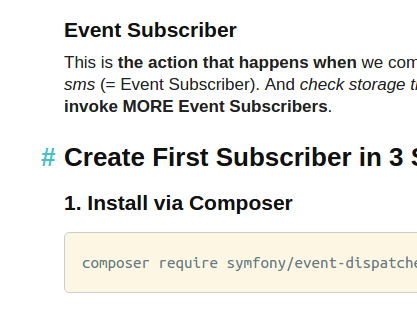

# Statie - PHP Static Site Generator

[![Build Status][ico-travis]][link-travis]
[![Quality Score][ico-code-quality]][link-code-quality]
[![Coverage Status][ico-scrutinizer]][link-scrutinizer]
[![Total Downloads][ico-downloads]][link-downloads]
[![Latest Version on Packagist][ico-version]][link-packagist]


Statie takes **Markdown files** and combines them with **Twig templates** to produce a set of static HTML files.

## Install via Composer

```
composer require symplify/statie
```

## Usage

### Base commands

#### Generate content from `/source` to `/output` in HTML

```
vendor/bin/statie generate
vendor/bin/statie generate --server
```

#### Push content of `/output` to Github pages

To push to e.g. [tomasvotruba/tomasvotruba.cz](https://github.com/TomasVotruba/tomasvotruba.cz) repository, call this:

```
vendor/bin/statie push-to-github-pages tomasvotruba/tomasvotruba.cz --token=${GH_TOKEN}
```

How to setup `${GH_TOKEN}`? Just check [this examplary .travis.yml](https://github.com/TomasVotruba/tomasvotruba.cz/blob/fddcbe9298ae376145622d735e1408ece447ea09/.travis.yml#L9-L26).

 

## Configuration

### Global variables

All `.neon` files found in `/source` directory are loaded to global variables.
You can store variables, lists of data etc.

So this...

```yaml
# source/config/config.neon
siteUrl: http://github.com
socials:
    facebook: http://facebook.com/github
```

...can be displayed in any template as:

```twig
# source/_layouts/default.latte
<p>Welcome to: {$siteUrl}</p>

<p>Checkout my FB page: {$socials['facebook']}</p>
```

### Modify Post Route format

To configure post url address just modify:

```yaml
# source/config/config.neon
configuration:
    postRoute: blog/:year/:month/:day/:title # default one
    # will produce post detail link: blog/2016/12/01/how-to-host-open-source-blog-for-free
    
    # other examples:
    # :year/:month/:title => 2016/12/how-to-host-open-source-blog-for-free
    # :year/:title => 2016/how-to-host-open-source-blog-for-free
    # blog/:title => blog/how-to-host-open-source-blog-for-free
```


### Enable Github-like Headline Anchors

When a headline is hovered, an anchor link to it will appear on the left.


 
```yaml
# source/config/config.neon
configuration    
    markdownHeadlineAnchors: FALSE # default one
    # TRUE will enable Github-like anchored headlines for *.md files     
```

You can use this sample css and modify it to your needs:

```css
/* anchors for post headlines */
.anchor {
    padding-right: .3em;
    float: left;
    margin-left: -.9em;
}

.anchor, .anchor:hover {
    text-decoration: none;
}

h1 .anchor .anchor-icon, h2 .anchor .anchor-icon, h3 .anchor .anchor-icon {
    visibility: hidden;
}

h1:hover .anchor-icon, h2:hover .anchor-icon, h3:hover .anchor-icon {
    visibility: inherit;
}

.anchor-icon {
    display: inline-block;
}
```


[ico-version]: https://img.shields.io/packagist/v/Symplify/Statie.svg?style=flat-square
[ico-travis]: https://img.shields.io/travis/Symplify/Statie/master.svg?style=flat-square
[ico-scrutinizer]: https://img.shields.io/scrutinizer/coverage/g/Symplify/Statie.svg?style=flat-square
[ico-code-quality]: https://img.shields.io/scrutinizer/g/Symplify/Statie.svg?style=flat-square
[ico-downloads]: https://img.shields.io/packagist/dt/Symplify/Statie.svg?style=flat-square

[link-packagist]: https://packagist.org/packages/Symplify/Statie
[link-travis]: https://travis-ci.org/Symplify/Statie
[link-scrutinizer]: https://scrutinizer-ci.com/g/Symplify/Statie/code-structure/master?elementType=class&orderField=test_coverage&order=asc&changesExpanded=0
[link-code-quality]: https://scrutinizer-ci.com/g/Symplify/Statie/code-structure/master/hot-spots
[link-downloads]: https://packagist.org/packages/symplify/statie/stats
