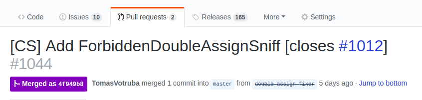

# Changelog Linker

[](https://packagist.org/packages/symplify/changelog-linker/stats)

Turn your `CHANGELOG.md` from a machine readable text to a **rich text that makes every programmer happy**.

## Install

```bash
composer require symplify/changelog-linker --dev
```

## Usage

Create `changelog-linker.php` with configuration:

```php
use Symfony\Component\DependencyInjection\Loader\Configurator\ContainerConfigurator;
use Symplify\ChangelogLinker\ValueObject\Option;

return static function (ContainerConfigurator $containerConfigurator): void {
    $parameters = $containerConfigurator->parameters();
    // this parameter is detected from "git origin", but you can change it
    $parameters->set(Option::REPOSITORY_URL, 'https://github.com/symplify/symplify');
};
```

The config is autodiscovered in the root directory or by `--config` option.

## A. Dump Merges

```bash
vendor/bin/changelog-linker dump-merges
```

### Write or Dry-run?

The `--dry-run` option prints the result to the output. Without that, I looks for `<!-- changelog-linker -->` in the `CHANGELOG.md` to replace with the content.

It finds the last #ID in the `CHANGELOG.md`, than looks on Github via API and dumps all the merged PRs since the last #ID in nice format. In case you want to **specify minimal PR id yourself**, use this:

```bash
vendor/bin/changelog-linker dump-merges --since-id 125
```

But that is a mash-up of everything. Not very nice:

```markdown
## Unreleased

- [#868] [ChangelogLinker] Add ChangeTree to manage merge messages
- [#867] [ChangelogLinker] Change Worker registration from implicit to explicit
- [#865] Improve Code Complexity
- [#864] [MonorepoBuilder] improve coverage
```

What if we'd have *Added*, *Changed*... all the standard categories?

```php
use Symfony\Component\DependencyInjection\Loader\Configurator\ContainerConfigurator;
use Symplify\ChangelogLinker\ValueObject\ChangelogFormat;
use Symplify\ChangelogLinker\ValueObject\Option;

return static function (ContainerConfigurator $containerConfigurator): void {
    $parameters = $containerConfigurator->parameters();
    $parameters->set(Option::CHANGELOG_FORMAT, ChangelogFormat::CATEGORIES_ONLY);
};
```

```bash
vendor/bin/changelog-linker dump-merges
```

↓

```markdown
## Unreleased

### Added

- [#828] [ChangelogLinker] Add Unreleased to last tagged version feature
- [#840] [ChangelogLinker] Add LinkifyWorker
```

Nice, now everything is nicely grouped.

*(Do you want to know how we detect the category? [Follow me](https://github.com/symplify/symplify/blob/master/packages/changelog-linker/src/ChangeTree/Resolver/CategoryResolver.php))*

You have 4 packages/cateogires options you can use:

```php
Symplify\ChangelogLinker\ValueObject\ChangelogFormat::PACKAGES_THEN_CATEGORIES;
Symplify\ChangelogLinker\ValueObject\ChangelogFormat::CATEGORIES_THEN_PACKAGES;
Symplify\ChangelogLinker\ValueObject\ChangelogFormat::CATEGORIES_ONLY;
Symplify\ChangelogLinker\ValueObject\ChangelogFormat::PACKAGES_ONLY;
```

### Base Branch

Do you want to dump only such pull requests that were merged into a particular branch? Just use `base-branch` option:

```bash
vendor/bin/changelog-linker dump-merges --base-branch=7.3
```
This is very handy when you support multiple versions of your project.

### Github API Overload?

In case you cross the API rate limit and get denied, create [new Github Token](https://github.com/settings/tokens) and run it via `GITHUB_TOKEN` ENV variable.

```bash
GITHUB_TOKEN super-secret-token vendor/bin/changelog-linker dump-merges
```

## B. Decorate `CHANGELOG.md`

```bash
vendor/bin/changelog-linker link
```

### 1. Link PR and Issues

```diff
 ### Added

-- #123 Cool new without detailed description wanting me to see PR, [closes #234]
+- [#123] Cool new without detailed description wanting me to see PR, [closes [#234]]
+
+[#123]: https://github.com/symplify/symplify/pull/123
+[#234]: https://github.com/symplify/symplify/pull/234
```

### 2. Link Versions to Diffs

```diff
-## v2.0.0 - 2017-12-31
+## [v2.0.0] - 2017-12-31

 - ...

 ## v1.5.0 - 2017-06-30
+
+[v2.0.0]: https://github.com/symplify/symplify/compare/v1.5.0...v2.0.0
```

### 3. Can I Thank My Contributors?

Of course! Give your contributors credit they deserve:

```diff
 ### [v2.0.0] - 2017-12-31

-- ... thanks @SpacePossum for help
+- ... thanks [@SpacePossum] for help
+
+[@SpacePossum]: https://github.com/SpacePossum
```

You can exclude core maintainers, to give external contributors more credit:

```php
use Symfony\Component\DependencyInjection\Loader\Configurator\ContainerConfigurator;
use Symplify\ChangelogLinker\ValueObject\Option;

return static function (ContainerConfigurator $containerConfigurator): void {
    $parameters = $containerConfigurator->parameters();
    // this parameter is detected from "git origin", but you can change it
    $parameters->set(Option::AUTHORS_TO_IGNORE, ['TomasVotruba']);
};
```

### 4. How to Link Specific Words?

In Symplify, I need that every `EasyCodingStandard` word leads to `https://github.com/symplify/easy-coding-standard/`.

```php
use Symfony\Component\DependencyInjection\Loader\Configurator\ContainerConfigurator;
use Symplify\ChangelogLinker\ValueObject\Option;

return static function (ContainerConfigurator $containerConfigurator): void {
    $parameters = $containerConfigurator->parameters();
    // this parameter is detected from "git origin", but you can change it
    $parameters->set(Option::NAMES_TO_URLS, [
        'EasyCodingStandard' => 'https://github.com/symplify/easy-coding-standard/',
    ]);
};
```

```diff
 ## Unreleased

 ### Added

-#### EasyCodingStandard
+#### [EasyCodingStandard]
+
+[EasyCodingStandard]: https://github.com/symplify/easy-coding-standard/
```

### 5. Can I Write Shorter PR Titles?



Just add alias to config:

```php
use Symfony\Component\DependencyInjection\Loader\Configurator\ContainerConfigurator;
use Symplify\ChangelogLinker\ValueObject\Option;

return static function (ContainerConfigurator $containerConfigurator): void {
    $parameters = $containerConfigurator->parameters();
    // this parameter is detected from "git origin", but you can change it
    $parameters->set(Option::PACKAGE_ALIASES, [
        'CS' => 'CodingStandard',
    ]);
};
```

...and it will be resolved to `CodingStandard` package.

<br>

## Report Issues

In case you are experiencing a bug or want to request a new feature head over to the [Symplify monorepo issue tracker](https://github.com/symplify/symplify/issues)

## Contribute

The sources of this package are contained in the Symplify monorepo. We welcome contributions for this package on [symplify/symplify](https://github.com/symplify/symplify).
